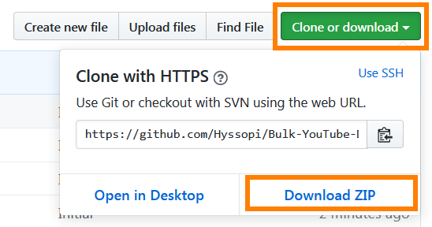

# Bulk YouTube Downloader
Downloads a list of YouTube links specified by the user.


## Prerequisites
- `Node.js` installed

## Build
(None)

## Run
1. Install Node.js

2. Download this repository as a zip file to your local PC. Then extract contents.

    

3. Create/modify the input JSON file:

    * Open `Bulk-YouTube-Downloader/input/Template.xlsx`.

    _

    * Add in your `Link Tag` and `Is Audio Only` download data, highlighted in **red**.

    * Copy the resulting output to clipboard, highlighted in **blue**.

    * Open (can also make a copy of the JSON file) `Template.json` in `Bulk-YouTube-Downloader/input/`.

    _

    * Paste contents of clipboard from previous steps into `"downloadList"`, highlighted in **yellow**. Remember to remove the extra `, ` in the beginning of the first line of `"downloadList"` contents.

    * (Optional) Change the name of `outputDirectoryPath`, highlighted in **magenta**.

4. (If you created a new input JSON file) Modify configuration file to link to your input JSON file in:

    `Bulk-YouTube-Downloader/config/configuration.json`

    For example:

    ```
    "input/Umihara Kawase.json"
    ```

5. Open command prompt/terminal.

6. Change directory to your `Bulk-YouTube-Downloader` folder location via `cd`.

7. Run `node main.js`.

8. To view progress: open `outputDirectoryPath/progress.html` in web browser, where `outputDirectoryPath` is the output folder name as specified in the `Template.json`.

    

## Test
(None)

## Notes
* Look in the samples provided, such as: `Bulk-YouTube-Downloader/input/Template.xlsx` and `Bulk-YouTube-Downloader/input/Umihara Kawase.json`

* This application will not download the file if the file already exists in the given path. If the file is corrupted/incomplete, then delete the file and rerun the application.

* The file is incomplete if you stop the download (for example, the progress is "`DOWNLOADING`") while it is ongoing. You should delete the file before rerunning the application.

* You can modify the input JSON file:
    ```
    "videoAudioFileFormat": ".mp4",
    "audioOnlyFileFormat": ".mp3",
    "parallelDownloadLimit": 2,
    ```
    The `videoAudioFileFormat` can use other file formats such as `.flv`.
    
    The `audioOnlyFileFormat` uses FFmpeg so can use formats supported by it, such as `.aac`.
    
    The `parallelDownloadLimit` specifies the maximum amount of parallel downloads ongoing. Recommended values are 2 to 5.
